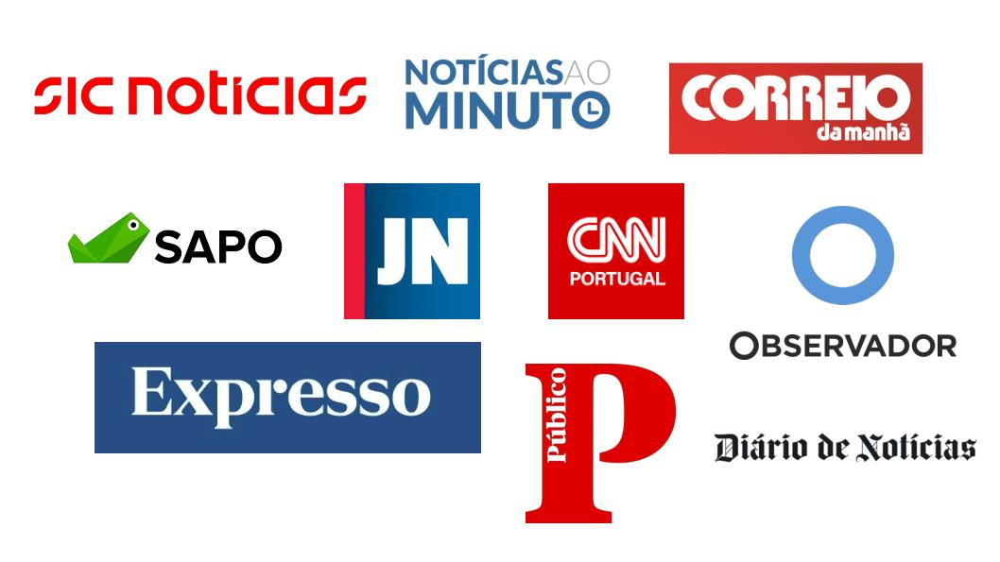

# Sobre o projeto

Quão positiva (ou negativa) foi a cobertura da imprensa portuguesa acerca do novo Acordo Ortográfico? E quanto à comunidades minorizadas como a LGBT? SentDiário é uma ferramenta que permite uma análise diacrônica detalhada das tendências midiáticas relativas a diferentes tópicos de interesse social. Nós apresentamos um modelo que permite classificar automaticamente o sentimento dos títulos de notícias, através de assuntos selecionados. Para esta versão *demo*, incluímos notícias arquivadas pelo **Arquivo.pt**, publicadas nos sites dos 10 principais portais de notícias de Portugal, de acordo com o [Instituto Reuters para o Estudo do Jornalismo](https://reutersinstitute.politics.ox.ac.uk/digital-news-report/2023/portugal): 

## Por que analisar o sentimento de textos jornalísticos?
[Vizeu](https://revistaseletronicas.pucrs.br/ojs/index.php/revistafamecos/article/view/6321) (2009, p.77) argumenta que o jornalismo é um ‘lugar de referência’. Isto é, um lugar que estabelece parâmetros da realidade, aonde as pessoas vão em busca de ‘estabilidade’. Desta forma, é através do consumo de notícias que temos acesso a fatos diversos do cotidiano, e a forma como os interpretamos é mediada pelos meios de comunicação. O fato de um jornal publicar mais notícias positivas ou negativas sobre determinado assunto tem, portanto, o potencial de não apenas reproduzir, mas também, construir uma visão positiva ou negativa acerca daquele determinado tópico. Assim, analisar o sentimento das notícias ajuda a compreender como assuntos de relevância social são reportados pelos diferentes meios e qual o ‘tom’ adotado pelos jornais.  

## Mas notícias não deveriam ser sempre neutras?  
Quando falamos em neutralidade no jornalismo ([Ojala,2021](https://www.tandfonline.com/doi/full/10.1080/1461670X.2021.1942150)), nos referimos à busca por uma reportagem que não tome partido e apresente uma visão equilibrada dos fatos. Ao propor uma análise de sentimento, estamos levando em consideração que textos de notícia podem ser positivos, negativos ou neutros, na medida em que o discurso faz usos de palavras que carregam esses sentimentos. Veja abaixo exemplos de notícias de polaridade positiva, neutra e negativa:

- Positivo: [Festival pretende promover inclusão social da comunidade LGBTS](https://arquivo.pt/noFrame/replay/20120809234829id_/http://www.dn.pt/cartaz/interior.aspx?content_id=2710584) 
- Neutro: [Nasce uma igreja todos os meses em Portugal](https://arquivo.pt/noFrame/replay/20190811192132id_/https://www.dn.pt/pais/interior/nasce-uma-igreja-todos-os-meses-em-portugal--10887303.html)
- Negativo: [Cidadãos lançam iniciativa contra acordo ortográfico no Facebook](https://arquivo.pt/noFrame/replay/20100608075542id_/http://www.publico.pt/Sociedade/cidadaos-lancam-iniciativa-contra-acordo-ortografico-no-facebook_1424865)

## E por que analisar somente os títulos das notícias? E quanto ao resto do texto?
Títulos de notícias exercem uma série de funções ([Scacco & Muddiman, 2016](https://mediaengagement.org/research/clickbait-headlines/)), especialmente quando se trata do jornalismo online, que depende de clicks para mensurar sua audiência. Seja o título um resumo do conteúdo ou um clickbait, ele é o primeiro nível de acesso à informação (a primeira impressão) e, muitas vezes, também a única. 

>*Clickbait* é o nome dado à estratégia de se utilizar de títulos super atrativos ao leitor. Esses títulos, muitas vezes, fazem uso de palavras alarmantes, criam mistérios ou perguntas a serem respondidas (ou não) pelo restante do texto caso o leitor o acesse.

Devido ao uso de paywalls ou por conta de hábitos de consumo de notícias pelas redes sociais, os títulos acabam sendo a única dimensão da notícia que muitos leitores consomem. Por fim, a análise dos textos apresenta um desafio técnico que pode elevar a imprecisão dos algoritmos devido aos longos parágrafos, os quais tendem a apresentar fatos diversos com conteúdos contraditórios e fazendo uso de uma linguagem menos adjetivada (portanto mais objetiva), o que tende a acontecer de forma oposta em títulos. 

## Como usar a ferramenta?

- [List the specific goals and objectives of the project.]             

## Metodologia 

Utilizamos a API do Arquivo.pt para realizar as buscas, identificando, para cada tema, as palavras-chave, os diferentes portais de notícias e fixando o período de tempo relevante. Cada notícia extraída é classificada automaticamente, a partir do respectivo título, como: a) positiva, b) negativa ou c) neutra.

[FinBERT-PT-BR](https://huggingface.co/lucas-leme/FinBERT-PT-BR) foi o modelo utilizado por ter apresentado os melhores resultados quando comparado a diferentes modelos de análise de polaridade. Testamos os seguintes modelos: `pysentimiento`, `lxyuan`, `citizenlab`, `HeyLucasLeao`, `igoramf` e `satoken`. Também testamos a combinação de diferentes modelos, porém, FinBERT-PT-BR apresentou a melhor acurácia a partir de uma avaliação manual de 150 títulos realizada por dois anotadores falantes nativos de português.

Os resultados obtidos são, então, processados para serem apresentados de maneira otimizada. Primeiramente, para cada tópico, fornecemos a distribuição do número de publicações por mês e por portal de notícias. Em seguida, apresentamos a tendência global (ou seja, todos os portais combinados) das publicações e a evolução temporal. Além disso, para cada portal, é possível verificar as diferentes evoluções diacrônicas relativas às diferentes etiquetas utilizadas em nossa classificação.

Nós selecionamos quatro tópicos para demonstrar o interesse da nossa ferramenta (imigração, novo acordo ortográfico, LGBT e direitos reprodutivos/aborto), porém, o potencial dela vai além, e pode ser adaptada para abranger uma diversidade de assuntos. 

## Sobre a análise de sentimento: 

- **Como funciona?**
  
A *análise de sentimento* é uma forma de se utilizar de algorítimos de Processamento de Linguagem Natural (PLN) para quantificar a itensidade emocional de palavras, frases e textos. Ferramentas de classificação de sentimento se tornaram populares por seu uso comercial, no qual empresas de utilizam desses algorítimos para analisar a recepção de seus produtos através de comentários de consumidores na internet. Algorítimos treinados em diversas bases de dados podem funcionar de formas diversas. Em sua forma mais básica, o algorítimo pode conter um dicionário criado por pessoas, no qual um sentimento é atribuído a uma série de palavras. Desta forma, para determinar o sentimento de uma frase, basta calcular quantas palavras positivas, negativas ou neutras estão presentes nela. Formas mais sofisticadas surgiram ao longo do tempo, permitindo que os algorítimos não apenas usassem um dicionário, mas também compreendenssem a sintaxe da língua. Com o uso de aprendizado de máquinas, tem sido possível gerar algorítimos cada vez mais eficientes, que consigam lidar com desafios linguísticos e frases mais complexas.
  
- **Quais as principais limitações dessa metodologia?**

  - Notícias tem uma tendência negativa
    
    Como lembram Toff, Palmer e Nielsen no livro *[Evitando notícias: audiências relutantes em relação ao jornalismo](https://cup.columbia.edu/book/avoiding-the-news/9780231205191)* (2023, p.1), "Jornalistas não cobrem pousos de aviões". Existe por tanto uma tendência do jornalismo a jogar luz sobre fatos disruptivos do cotidiano, que tendem a ter uma natureza negativa. Há também indicativos de que o número de notícias negativas têm potencialmente aumentado ao longo dos últimos anos. De acordo com uma [pesquisa](https://journals.plos.org/plosone/article?id=10.1371/journal.pone.0276367) realizada por Rozado, Hudges e Halberstadt (2022), ouve um aumento no número de notícias negativas publicadas entre os anos 2000 e 2019 nos Estados Unidos. Os autores utilizaram análise de sentimento num corpus composto de 23 milhões de títulos de notícias publicadas por 47 meios de comunicação populares no país. Esse viés, entretanto, deve variar de acordo com o tópico ou evento analisado, sendo notícias positivas mais facilmente encontradas nas seções de 'viagens' ou 'esportes' de um jornal, por exemplo.  

  - Classificação negativa não significa necessariamente uma notícia ruim
    
    O método de classificação automatizada de sentimento considera o sentimento discursivamente expresso no texo a partir da escolha das palavras. Na notícia *[ONU critica resposta da administração Trump a manifestações racistas](https://arquivo.pt/noFrame/replay/20170831232240id_/http://observador.pt/2017/08/23/onu-critica-resposta-da-administracao-trump-a-manifestacoes-racistas/)*, por exemplo, por mais que a notícia seja boa (por se tratar de uma crítica a manifestações racistas), o fato de a notícia conter as palavras 'critica' e 'racistas' faz com que a polaridade seja calculada pelo algorítimo como 'negativa'. A classificação 'negativa', por tanto, se trata do uso de palavras negativas, e não, necessariamente, do fato de uma notícia ser boa ou ruim.  
  
  - Algumas frases são complexas demais
    
    Neste título *[Vasco Pulido Valente. Marcelo elogia "impiedosa independência crítica"](https://arquivo.pt/noFrame/replay/20200327212418id_/https://www.dn.pt/poder/amp/vasco-pulido-valente-marcelo-elogia-impiedosa-independencia-critica-11848581.html)* há um elogio feito com uso de palavras negativas ('impiedosa', 'crítica'). Enquanto um cronista, ser considerado como dono de uma 'impiedosa independência crítica' é positivo. Daí o motivo de algorítimos de análise de sentimento serem 'sensíveis ao contexto'. Frases que se utilizam de ironias e sarcasmo também dificultam a classificação de sentimento. Algumas vezes, sendo difícil não apenas para as máquinas (algorítimos) mas também para humanos interpretá-las. 

- **Os resultados são confiáveis?**

Como argumenta Rogers em [Doing Digital Methods](https://books.google.com/books/about/Doing_Digital_Methods.html?id=DLuODwAAQBAJ) (2019), reconhecer as limitações dos dados e suas formas de uso é inerente ao uso de métodos digitais. Embora o uso de classificações automatizadas de sentimento apresente desafios, esse método pode facilitar uma análise exploratória dos dados. Combinar esse método com outros, sejam eles quantitativos ou qualitativos (como a leitura manual dos dados),  é desejável para que seus resultados possam ser interpretados da melhor maneira e, em alguns casos, generalizados. 

> Para aprender mais sobre análise de sentimento: 
> - Zoë Wilkinson Saldaña, "Análise de sentimento para exploração de dados", traduzido por Caio Mello, Programming Historian em português 1 (2021), https://doi.org/10.46430/phpt0017.
> - Jennifer Isasi, "Análise de sentimentos em R com 'syuzhet'", traduzido por Diana Rebelo Rodriguez, Programming Historian em português 2 (2022), https://doi.org/10.46430/phpt0022.

## Autores

- [Caio Mello](https://caiocmello.github.io/): PhD Candidate, School of Advanced Study, University of London | E-mail: caiomellodh@gmail.com

- [Dr. Diego Alves](https://dfvalio.github.io/): Postdoctoral Researcher, Saarland University| E-mail: dfvalio@gmail.com

- [Dr. Gaurish Thakkar](https://thak123.github.io/): Researcher, University of Zagreb | E-mail: thak123@gmail.com
---
Obrigado por visitar nossa página. Para mais informações, sinta-se à vontade para entrar em contato com os autores do projeto. 
